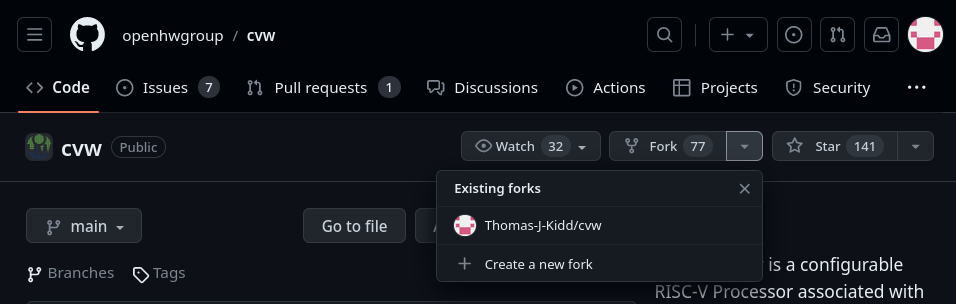

# Intro

This guide will help you learn how you can contribute to WALLY! A good description of Wally can be found at the original GitHub repository by the open hardware group: https://github.com/openhwgroup/cvw

Wally is a 5-stage pipelined processor configurable to support all the standard RISC-V options, incluidng RV32/64, A, C, F, D, Q, M, and Zb* extensions, virtual memory, PMP, and the various privileged modes and CSRs. It provides optional caches, branch prediction, and standard RISC-V peripherals (CLINT, PLIC, UART, GPIO). Wally is written in SystemVerilog. It passes the RISC-V Arch Tests and boots Linux on an FPGA. Configurations range from a minimal RV32E core to a fully featured RV64GC application processor.

# Step 1 Get your own version of Wally
In order to contribute to an Open Source project you will need to have a version of Wally on your server or computer. If you are at Oklahoma State University, you will most likely have a user assigned to you on a specific server. This is where you would work on Wally. Before you do the next steps make sure you have SSH'd or RealVNC'd into the computer. 

Wally is maintained by a group of people on their GitHub who review and accept changes to the repository if they think its a good change or addition to the project. 

In order for you to also work on Wally you will want to fork the repository. Not clone, but **fork**. 


	 
Having your own fork is nice. You can make whatever changes you want to it, back it up (push to github) and not worry about someone not liking your changes. This is nice because it allows you to make changes that you can back up without having a complete finished modification. Once you are done,, you can then create a pull request, where one of the maintainers of Wally will review your pull request. If they like it :) if not :(

# Step 2 Clone your own fork

You will want to setup an SSH key to your Github account first. Follow this guide: https://docs.github.com/authentication/connecting-to-github-with-ssh

1) open a terminal session
2) Clone your fork with `git clone git@github.com:*your_user_name*/*your_for_name*.git` 

# Step 3 Setting up your host environment
Next you want to checkout this guide on setting up your host environment
[[Setting up setup-host.sh file]]

# Step 4 Add some bins to your .bashrc file
The tools we use for wally are programs on your server. These tools have locations that they are stored in. When you want to make the simulations or execute certain programs, Wally needs to know where those tools are. Linux based systems usually store these in `bin`folders. We need to make sure we add a couple of different folders to our `.bashrc` so Wally (in our terminal) knows where to look for these programs. 

```bash
# custom bashrc for Wally
export MGLS_LICENSE_FILE=1717@trelaina.ecen.okstate.edu
export PATH=$PATH:/opt/ModelSim/questasim/bin/
export PATH=$PATH:/opt/riscv/bin/
```

These are some of the lines you might have to add. This might be incomplete, and needs extra attention. Please ask your instructor, TA, or someone who knows how this works. 


# Step 5 Start your journey with Wallk
